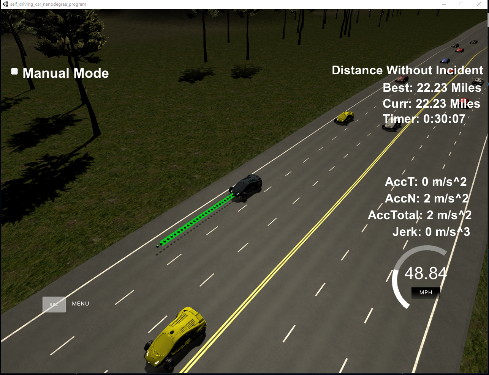

# CarND-Path-Planning-Project
Self-Driving Car Engineer Nanodegree Program
   
### Simulator.
You can download the Term3 Simulator which contains the Path Planning Project from the [releases tab (https://github.com/udacity/self-driving-car-sim/releases/tag/T3_v1.2).  

To run the simulator on Mac/Linux, first make the binary file executable with the following command:
```shell
sudo chmod u+x {simulator_file_name}
```

### Goals
In this project your goal is to safely navigate around a virtual highway with other traffic that is driving +-10 MPH of the 50 MPH speed limit. You will be provided the car's localization and sensor fusion data, there is also a sparse map list of waypoints around the highway. The car should try to go as close as possible to the 50 MPH speed limit, which means passing slower traffic when possible, note that other cars will try to change lanes too. The car should avoid hitting other cars at all cost as well as driving inside of the marked road lanes at all times, unless going from one lane to another. The car should be able to make one complete loop around the 6946m highway. Since the car is trying to go 50 MPH, it should take a little over 5 minutes to complete 1 loop. Also the car should not experience total acceleration over 10 m/s^2 and jerk that is greater than 10 m/s^3.

#### The map of the highway is in data/highway_map.txt
Each waypoint in the list contains  [x,y,s,dx,dy] values. x and y are the waypoint's map coordinate position, the s value is the distance along the road to get to that waypoint in meters, the dx and dy values define the unit normal vector pointing outward of the highway loop.

The highway's waypoints loop around so the frenet s value, distance along the road, goes from 0 to 6945.554.

## Basic Build Instructions

1. Clone this repo.
2. Make a build directory: `mkdir build && cd build`
3. Compile: `cmake .. && make`
4. Run it: `./path_planning`.

Here is the data provided from the Simulator to the C++ Program

#### Main car's localization Data (No Noise)

["x"] The car's x position in map coordinates

["y"] The car's y position in map coordinates

["s"] The car's s position in frenet coordinates

["d"] The car's d position in frenet coordinates

["yaw"] The car's yaw angle in the map

["speed"] The car's speed in MPH

#### Previous path data given to the Planner

//Note: Return the previous list but with processed points removed, can be a nice tool to show how far along
the path has processed since last time. 

["previous_path_x"] The previous list of x points previously given to the simulator

["previous_path_y"] The previous list of y points previously given to the simulator

#### Previous path's end s and d values 

["end_path_s"] The previous list's last point's frenet s value

["end_path_d"] The previous list's last point's frenet d value

#### Sensor Fusion Data, a list of all other car's attributes on the same side of the road. (No Noise)

["sensor_fusion"] A 2d vector of cars and then that car's [car's unique ID, car's x position in map coordinates, car's y position in map coordinates, car's x velocity in m/s, car's y velocity in m/s, car's s position in frenet coordinates, car's d position in frenet coordinates. 

## Details

1. The car uses a perfect controller and will visit every (x,y) point it recieves in the list every .02 seconds. The units for the (x,y) points are in meters and the spacing of the points determines the speed of the car. The vector going from a point to the next point in the list dictates the angle of the car. Acceleration both in the tangential and normal directions is measured along with the jerk, the rate of change of total Acceleration. The (x,y) point paths that the planner recieves should not have a total acceleration that goes over 10 m/s^2, also the jerk should not go over 50 m/s^3. (NOTE: As this is BETA, these requirements might change. Also currently jerk is over a .02 second interval, it would probably be better to average total acceleration over 1 second and measure jerk from that.

2. There will be some latency between the simulator running and the path planner returning a path, with optimized code usually its not very long maybe just 1-3 time steps. During this delay the simulator will continue using points that it was last given, because of this its a good idea to store the last points you have used so you can have a smooth transition. previous_path_x, and previous_path_y can be helpful for this transition since they show the last points given to the simulator controller with the processed points already removed. You would either return a path that extends this previous path or make sure to create a new path that has a smooth transition with this last path.

## Dependencies

* cmake >= 3.5
  * All OSes: [click here for installation instructions](https://cmake.org/install/)
* make >= 4.1
  * Linux: make is installed by default on most Linux distros
  * Mac: [install Xcode command line tools to get make](https://developer.apple.com/xcode/features/)
  * Windows: [Click here for installation instructions](http://gnuwin32.sourceforge.net/packages/make.htm)
* gcc/g++ >= 5.4
  * Linux: gcc / g++ is installed by default on most Linux distros
  * Mac: same deal as make - [install Xcode command line tools]((https://developer.apple.com/xcode/features/)
  * Windows: recommend using [MinGW](http://www.mingw.org/)
* [uWebSockets](https://github.com/uWebSockets/uWebSockets)
  * Run either `install-mac.sh` or `install-ubuntu.sh`.
  * If you install from source, checkout to commit `e94b6e1`, i.e.
    ```
    git clone https://github.com/uWebSockets/uWebSockets 
    cd uWebSockets
    git checkout e94b6e1
    ```

# Reflection

To make the project easier to manage and extend in the future, I decided to split it into multiple modules. Each module has distinct responsibilities:

- TrajectoryPlanner - responsible for planning of the trajectory between each processing cycle
- TrajectoryGenerator - utility module reponsible for generating various trajectories for both our car and other traffic
- BehaviorPlanner - high level component which generates multiple plans for the next cycle and picks the most optimal one

As a general rule, I tried to use Frenet coordinates where possible. They make it much easier to do any kind of math as well as to vizualize what is actually going on based on the pure numbers returned by the planners and/or sensor fusion. Also, for easier work with code and to prevent unnecessary bugs (e.g. comparing frenet to XY coordinates), I use various wrappers for basic data types across the code. 

## Trajectory planner

Trajectory planner produces new trajectory in each processing cycle of the car. The car simulator advances the car each 0.02 seconds (which I call "step") and trajectory planner always plans 35 steps ahead, which gives us 0.7 seconds of planned trajectory. To ensure smooth transition between cycles, we always add new steps to whichever steps weren't processed in the last cycle. For example, if we processed only 10 steps in the last cycle out of 35, Trajectory planner will plan only 10 new steps based on a new plan. It is important to note, that even though planning ahead gives us smooth trajectory as well as more time to process sensor inputs, it is crucial to set it only to reasonable value, because otherwise the car wouldn't be able to react to the rest of traffic (e.g. car changing lanes). Therefore, using shorter plans are preferrable. The choice of the path length is ultimately dependent on computing capabilities of our car/computer. 

## Trajectory generator

Trajectory generator is responsible for generating trajectories for our car and also for generating of predicted trajectories for the rest of the traffic. I leveraged the Spline library to generate smooth paths without jerk. Maximum jerk for my trajectory generator is set to about 7 m/s (in case of heavy braking or fast acceleration). TrajectoryGenerator takes as an input the current state of our car (e.g. position, speed...), the plan created by BehaviorPlanner and number of steps that should be generated. Maximum speed of the car has been set to 49 Mph. 

This module also generates predictions for the rest of the traffic. We always predict only straight paths (in Frenet coordinates) based on current car speed and position . 

## Behavior planner 

The path planning logic is implemented in behavior planner. Essentially, it follows the code from the Behavior Planning lesson:

  def transition_function(predictions, current_fsm_state, current_pose, cost_functions, weights):
    # only consider states which can be reached from current FSM state.
    possible_successor_states = successor_states(current_fsm_state)

    # keep track of the total cost of each state.
    costs = []
    for state in possible_successor_states:
        # generate a rough idea of what trajectory we would
        # follow IF we chose this state.
        trajectory_for_state = generate_trajectory(state, current_pose, predictions)

        # calculate the "cost" associated with that trajectory.
        cost_for_state = 0
        for i in range(len(cost_functions)) :
            # apply each cost function to the generated trajectory
            cost_function = cost_functions[i]
            cost_for_cost_function = cost_function(trajectory_for_state, predictions)

            # multiply the cost by the associated weight
            weight = weights[i]
            cost_for_state += weight * cost_for_cost_function
         costs.append({'state' : state, 'cost' : cost_for_state})

    # Find the minimum cost state.
    best_next_state = None
    min_cost = 9999999
    for i in range(len(possible_successor_states)):
        state = possible_successor_states[i]
        cost  = costs[i]
        if cost < min_cost:
            min_cost = cost
            best_next_state = state 

    return best_next_state

Behavior planner predicts traffic for 100 steps ahead (which equals to 2 seconds). Longer predictions are not necessary as the traffic changes quite often and thus renders the plan obsolete. 

### Generating successor states

First, BP generates a bunch of possible successor states for each car lane. It always generates a state at maximum speed. Then it also tries to generate states with various speed of cars ahead of us in adjacent lanes (where possible), as well as with slight lower speeds (to cover also the need when the car must slow down because it got too close to other cars).

### Generating predictions for surrounding traffic

When generating predictions for surround traffic, BP takes into consideration only cars up to 100 m ahead of us and 25 m behind us (for collision detection). The actual predictions are created by TrajectoryGenerator module, based on the information from sensor fusion (car position, speed).

### Picking the best successor state

The final step of behavior planning cycle is to assign costs to each generated state. To do this, I use a couple of cost functions to determine the feasibility of each state together with the predicted state of traffic:

- intended speed cost - to reward higher car speeds
- car proximity cost - to rewards if the car keeps buffer from other cars in intended lane
- car-in-lane cost - which penalizes traffic outside car lanes as well as makes it little harder for the car to change the lane (just to prevent unnecessary line switches)
- collision cost - to prevent collision with surrounding traffic
- driving outside lane center cost - to prevent driving between lanes for too long
- car-in-fron cost - to reward the car for driving in a lane with traffic that is further away (or not present)

All costs have assigned weights, which were tuned to make the car drive safely. See *src/behavior/behavior_consts.hpp* for actual values. 
Once we assign costs to all states, BP simply picks the plan with the lowest cost and passes it to Trajectory planner. 

## Conclusion

The overall performance of proposed algorithm is meeting the expectation. The car was able to drive for over 30 minutes (over 22 miles) without causing any collision:



Even though the driving is safe and quite optimal in general, further tuning would be required to improve the behavior in some rare case (e.g. with very dense traffic). However, sice it's impossible to simulate such scenarios in the current simulator, I leave this an option for future learning.


